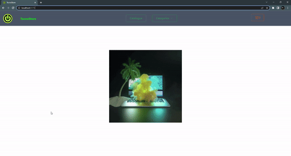

# Ecommerce sobre una tienda de computación

*Proyecto de ReactJs en el que se aplica a un ecommerce*

En este caso, desarrollamos una aplicación consistente en una tienda virtual de compra de insumos de computación, donde el usuario podrá realizar las siguientes acciones:

* Visualizar la totalidad de productos y su detalle.
* Filtrar productos por categorías.
* Agregar o eliminar productos a su carrito de compras.
* Concretar la compra que haya seleccionado.

  

---

Mi perfil: [LinkedIn](https://www.linkedin.com/in/luisj-bustamante/)